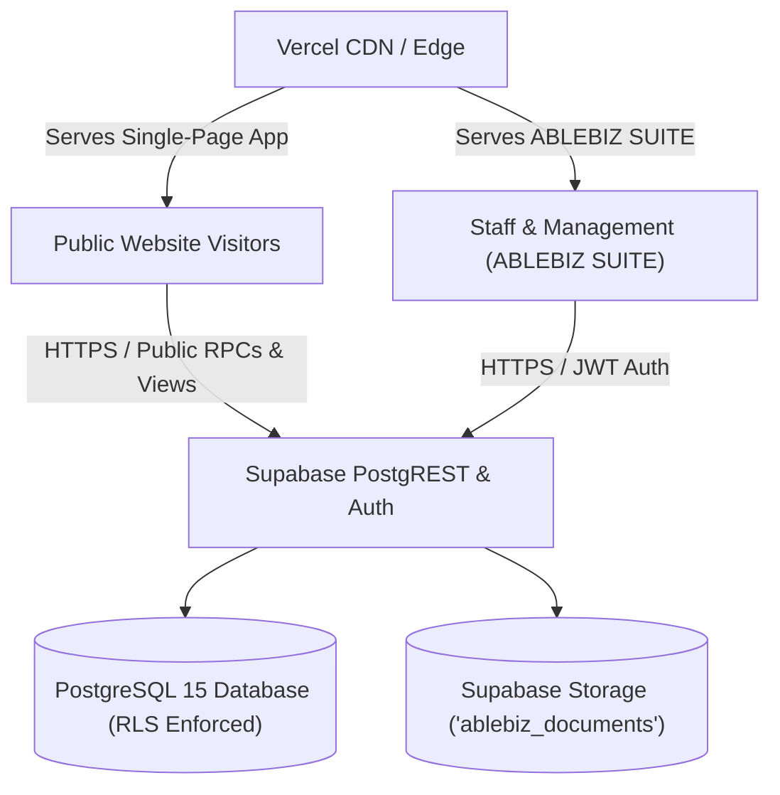
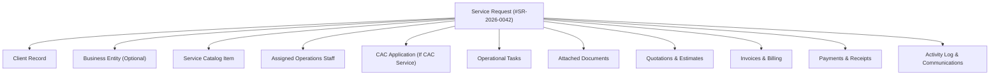
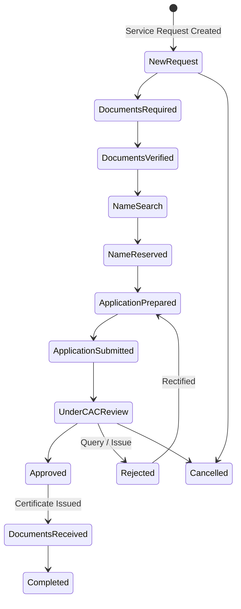
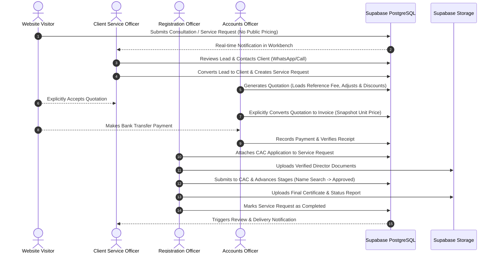
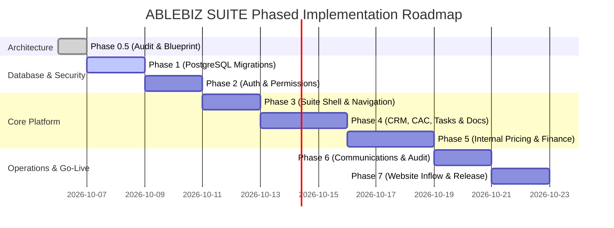

# ABLEBIZ SUITE — Final Production Architecture Specification
**Document ID:** `DOC-ABZ-ARCH-2026-V1-REV2`  
**Target Platform:** ABLEBIZ SUITE — Enterprise Business Management & Operations Platform  
**Company:** ABLEBIZ BUSINESS SERVICES (Abeokuta, Ogun State, Nigeria)  
**Version:** 1.2 (Implementation Gate Finalized: Operational Navigation, Price Snapshotting & Zero Data Destruction)  
**Status:** Approved for Implementation Roadmap

---

## Table of Contents
1. [System Overview](#1-system-overview)
2. [Technology & Navigation Architecture](#2-technology--navigation-architecture)
3. [Authentication Architecture](#3-authentication-architecture)
4. [Authorization & Row Level Security (RLS)](#4-authorization--row-level-security-rls)
5. [CRM Architecture](#5-crm-architecture)
6. [Service Architecture (Public Presentation vs. Internal Suite Pricing)](#6-service-architecture-public-presentation-vs-internal-suite-pricing)
7. [Service Request Architecture (The Central Operational Object)](#7-service-request-architecture-the-central-operational-object)
8. [CAC Operations & Specialized Workflows](#8-cac-operations--specialized-workflows)
9. [Quotation Architecture](#9-quotation-architecture)
10. [Invoice Architecture & Financial Integrity](#10-invoice-architecture--financial-integrity)
11. [Payment Architecture](#11-payment-architecture)
12. [Expense & Vendor Architecture](#12-expense--vendor-architecture)
13. [Document & Storage Architecture](#13-document--storage-architecture)
14. [Task Management Architecture](#14-task-management-architecture)
15. [Communication & Follow-up Architecture](#15-communication--follow-up-architecture)
16. [Referral & Partner Program Architecture](#16-referral--partner-program-architecture)
17. [Operational & Financial Reporting Architecture](#17-operational--financial-reporting-architecture)
18. [Staff & Role-Based Permissions Architecture](#18-staff--role-based-permissions-architecture)
19. [Audit Logging Architecture](#19-audit-logging-architecture)
20. [Website Integration & Inflow Architecture](#20-website-integration--inflow-architecture)
21. [Manager Workbench ("What Requires Attention Today?")](#21-manager-workbench-what-requires-attention-today)
22. [Unified Activity Timeline Architecture](#22-unified-activity-timeline-architecture)
23. [Future Client Portal Compatibility (Forward-Engineered)](#23-future-client-portal-compatibility-forward-engineered)
24. [End-to-End Operational Data Flow](#24-end-to-end-operational-data-flow)
25. [Database Entity-Relationship Model (ERD)](#25-database-entity-relationship-model-erd)
26. [Security Model & Threat Mitigation](#26-security-model--threat-mitigation)
27. [Migration Strategy & Zero-Downtime Transition](#27-migration-strategy--zero-downtime-transition)
28. [Phased Implementation Roadmap](#28-phased-implementation-roadmap)
29. [Concise Architectural Delta: KEEP / MODIFY / REMOVE / ADD / MIGRATE](#29-concise-architectural-delta)

---

## 1. System Overview
**ABLEBIZ BUSINESS SERVICES** is an award-winning Nigerian corporate compliance and consultancy firm based in Abeokuta, Ogun State. Services include Corporate Affairs Commission (CAC) registrations (Business Name, Company Incorporation, Incorporated Trustees/NGOs), Annual Returns filings, Post-Incorporation alterations, Tax Identification Number (TIN) registrations, Special Control Unit Against Money Laundering (SCUML) certificates, business planning, accounting, and business consultancy.

**ABLEBIZ SUITE** is the internal business management operating system that powers all client engagements, operations, document workflows, internal pricing, quotations, invoicing, payments, staff tasks, and compliance tracking. It bridges the public marketing website directly into an operational command center.

### Core Architectural Principles
1. **Single Source of Truth**: All operational and financial records live in Supabase PostgreSQL. No `localStorage` database emulation.
2. **Strict Separation of Public Presentation & Internal Suite Pricing**:
   - **Public Website**: Zero public pricing pages, zero public package tiers (Starter/Standard/Premium), zero public comparison tables, and zero publicly displayed service fees. Services are showcased with descriptions, deliverables, requirements, timelines, and calls-to-action for enquiries or quotes.
   - **ABLEBIZ SUITE**: Full internal pricing and financial control engine. Staff configure internal/default service fees in `services_catalog`, view service pricing, generate custom editable quotations, apply discounts with permission, produce detailed invoices with unit prices/taxes, record payments, calculate outstanding balances, and analyze gross and net revenue.
   - **Database & RLS Separation**: Public anonymous website queries are restricted to public columns or a dedicated public view (`public.public_services_view`) that strips internal fee structures (`default_fee_ngn`, `min_fee_ngn`, `internal_cost_estimate`, `pricing_notes`), ensuring business pricing margins are never leaked.
3. **Price Snapshotting & Immutable Financial Integrity**:
   - `services_catalog.default_fee_ngn` is an **internal reference price**, NOT the historical price of previous transactions.
   - When a quotation is created: `services_catalog.default_fee_ngn` is copied into `quotation_items.unit_price`.
   - When an invoice is created: `quotation_items.unit_price` is copied into `invoice_items.unit_price`.
   - Subsequent changes to the service catalog fee will **NEVER** alter existing quotations or invoices.
4. **Service Request as the Center**: The `service_requests` table binds together Client, Business, Service, Assigned Staff, Quotations, Invoices, Payments, CAC Applications, Tasks, Documents, Communications, and Activity History.
5. **No Destructive Migration**: Historical package structures, quotes, invoices, payments, and client records are permanently preserved.

---

## 2. Technology & Navigation Architecture

### 2.1 Technology Stack


- **Frontend Framework**: React 19 + TypeScript (Vite 7)
- **Styling & UI**: Tailwind CSS (Enterprise ABLEBIZ theme: Deep Green `#043F2E`, Obsidian, White, Gold/Amber accents)
- **Database**: Supabase PostgreSQL with strict foreign keys, constraints, and audit triggers
- **Identity & Authentication**: Supabase Auth (GoTrue, JWT, secure HTTP cookies/bearer tokens)
- **Storage**: Supabase Storage (`ablebiz_documents` bucket with signed URLs and RLS)
- **Hosting & Deployment**: Vercel (Production edge network with environment variables)

### 2.2 Conceptual Navigation Architecture
The ABLEBIZ SUITE navigation is grouped into clear business domains. **The Service Catalogue belongs strictly under OPERATIONS, not Finance:**

```
OVERVIEW
├── Dashboard (Manager Workbench)
└── Notifications

CRM
├── Leads (Inbound Pipeline & Qualification)
├── Clients (Client 360° Profiles)
├── Businesses (Incorporated & Registered Entities)
└── Follow-ups (Scheduled Calls & Touchpoints)

OPERATIONS
├── Services (Internal Service Catalogue & Reference Fees)
├── Service Requests (The Central Operational Hub)
├── CAC Operations (11-Stage Specialized Filing Engine)
├── Tasks (Team Task Board & Comments)
└── Documents (Supabase Storage Repository)

FINANCE
├── Quotations (Estimates & Client Acceptance)
├── Invoices (Enforceable Billing & Balance Tracking)
├── Payments (Receipts & Reconciliation)
├── Expenses (Operational Disbursements & Job Costing)
└── Vendors (Filing Authorities, Suppliers & Contractors)

COMMUNICATION
├── Communications (Call logs, WhatsApp, Emails)
└── Notifications (Internal Staff Alerts)

GROWTH
├── Referrals (Partner Program & Milestones)
└── Marketing (Lead Sources & Campaigns)

REPORTING
├── Reports (Executive Financial & Operational Reports)
└── Analytics (CAC Turnaround, Conversion & Margin Analytics)

TEAM
├── Staff (Staff Profiles & Directory)
├── Roles & Permissions (Access Gates across 8 Roles)
└── Audit Logs (Immutable Activity Ledger)

AI
└── ABLEBIZ AI Secretary (Operational & Drafting Assistant)

SETTINGS
├── Business Settings (Company Profile & Banking Details)
└── System Settings (Security & System Configuration)
```

---

## 3. Authentication Architecture

### 3.1 Supabase Auth Integration
- All staff authentication is handled exclusively by **Supabase Auth** (`auth.users`).
- No passwords, hashes, or credentials will ever touch `localStorage` or `sessionStorage`.
- The login endpoint `src/pages/admin/Login.tsx` calls `supabase.auth.signInWithPassword({ email, password })`.
- JWT session tokens are managed securely in memory and Supabase client storage, refreshed automatically via `supabase.auth.onAuthStateChange`.
- Password reset workflows utilize Supabase Auth email recovery tokens (`supabase.auth.resetPasswordForEmail`).

### 3.2 Staff Identity Mapping
Every authenticated staff member is mapped 1:1 to a record in `public.staff_profiles` via `auth_uid = auth.uid()`:
```sql
create table public.staff_profiles (
  id uuid primary key default gen_random_uuid(),
  auth_uid uuid not null unique references auth.users(id) on delete cascade,
  email text not null unique,
  full_name text not null,
  role public.staff_role not null default 'viewer',
  department text not null default 'General',
  phone text,
  is_active boolean not null default true,
  avatar_url text,
  created_at timestamptz not null default now(),
  updated_at timestamptz not null default now()
);
```

---

## 4. Authorization & Row Level Security (RLS)

### 4.1 The 8 Staff Roles
1. **Super Administrator (`super_admin`)**: Full unrestricted system access, staff management, audit log viewing, financial approvals.
2. **Administrator (`admin`)**: Day-to-day managerial access, client management, quotations, invoicing, task delegation.
3. **Operations Manager (`operations_manager`)**: Directs CAC operations, reviews service requests, assigns tasks, verifies documents.
4. **Registration Officer (`registration_officer`)**: Executes CAC filings, name searches, submission updates, document verification.
5. **Accounts Officer (`accounts_officer`)**: Manages quotations, invoices, payments, expense records, internal pricing, financial reconciliation.
6. **Client Service Officer (`client_service_officer`)**: Manages leads, follow-ups, client communications, onboarding, quote generation.
7. **Marketing Officer (`marketing_officer`)**: Manages referrals, lead acquisition channels, conversion attribution.
8. **Viewer (`viewer`)**: Read-only oversight on authorized records.

### 4.2 Row Level Security Architecture
- Public anonymous users (`anon`) have **ZERO** direct SELECT/UPDATE/DELETE access on operational tables (`service_requests`, `cac_applications`, `quotations`, `invoices`, `payments`, `expenses`, `tasks`, `documents`, `audit_logs`).
- Public anonymous users access only:
  1. Validated inbound RPC functions (`ablebiz_create_consultation_request`, `ablebiz_create_spin_and_reward`, `ablebiz_create_checklist_download`).
  2. Public service view (`public.public_services_view`) that strictly conceals all internal pricing fields.
- Authenticated staff (`authenticated`) access records governed by RLS helper functions:
  ```sql
  create or replace function public.current_staff_role()
  returns public.staff_role language sql stable security definer as $$
    select role from public.staff_profiles where auth_uid = auth.uid() and is_active = true;
  $$;
  ```
- Sensitive operations (e.g. modifying default service fees, approving discounts over threshold, cancelling paid invoices) require `super_admin`, `admin`, or `accounts_officer` permissions.

---

## 5. CRM Architecture


### 5.1 Leads & Qualification
- **Table**: `public.leads`
- Inbound inquiries from Website Consultation Forms, WhatsApp clicks, Spin & Win, and Checklist Downloads enter as `leads`.
- Statuses: `new`, `contacted`, `qualified`, `disqualified`, `converted`.
- When qualified, staff click **"Convert to Client"**, which creates:
  1. A central `clients` record.
  2. Optionally a linked `businesses` record.
  3. Optionally an initial `service_requests` record.
  4. Marks the lead as `is_converted = true` with a pointer to `converted_client_id`.

### 5.2 Client 360° Profile
- **Table**: `public.clients`
- The central record representing the paying individual or corporate representative.
- Contains: Full name, primary email, primary phone, alternate phone, state of operation, address, acquisition source, referral code, notes, lifetime value.
- Forward-engineered column: `portal_user_id uuid references auth.users(id)` allows future client portal activation without database migration.
- **Client 360° Tabs**:
  - Overview & Contact Info
  - Associated Businesses
  - Service Requests & CAC Applications
  - Quotations, Invoices & Payments (with Outstanding Balance)
  - Uploaded Documents & Certificates
  - Activity Timeline & Follow-ups
  - Communication Log (Calls / WhatsApp / Notes)

### 5.3 Business Entities
- **Table**: `public.businesses`
- Represents formal or prospective legal entities linked to a client.
- Fields: `client_id`, `name`, `alternate_name`, `entity_type` (Business Name, Company Limited by Shares, NGO/Trustees, Limited Partnership), `registration_number` (RC/BN/IT), `tax_identification_number` (TIN), `annual_return_due_date`, `registered_address`, `status`.

---

## 6. Service Architecture (Public Presentation vs. Internal Suite Pricing)

### 6.1 The Core Distinction: Public Presentation vs. Internal Suite Configuration

```
services_catalog (Located under OPERATIONS in navigation)
├── Public Information (Exposed to Website)
│   ├── name
│   ├── slug
│   ├── category
│   ├── short_description
│   ├── full_description
│   ├── deliverables (JSON list of what client receives)
│   ├── requirements (client prerequisites and required documents)
│   ├── expected_turnaround_days
│   └── public display settings (is_publicly_visible, display_order)
│
└── Internal Configuration (Restricted to ABLEBIZ SUITE)
    ├── default_fee_ngn (standard internal reference price)
    ├── min_fee_ngn (floor price for discount threshold control)
    ├── internal_cost_estimate (statutory filing fee cost baseline)
    ├── pricing_notes (internal guidance for staff quoting this service)
    ├── assigned_department
    ├── default_workflow (CAC, Tax, SCUML, Advisory)
    ├── operational_checklist_template
    └── is_active
```

### 6.2 Price Snapshotting & Historical Immutability
1. **Reference Price Only**: `services_catalog.default_fee_ngn` is an **internal reference price**, NOT the historical price of previous transactions.
2. **Snapshotting on Quotation**: When a quotation is created, `services_catalog.default_fee_ngn` is copied into `quotation_items.unit_price`. Staff can edit this value or apply discounts.
3. **Snapshotting on Invoicing**: When an invoice is created, `quotation_items.unit_price` is copied into `invoice_items.unit_price`.
4. **Historical Immutability**: Any subsequent update to `services_catalog.default_fee_ngn` will **NEVER** alter previously generated quotations, invoices, or financial reports.

### 6.3 Schema Definition: `public.services_catalog`
```sql
create table public.services_catalog (
  id uuid primary key default gen_random_uuid(),
  name text not null,
  slug text not null unique,
  category text not null,
  short_description text,
  full_description text,
  deliverables jsonb default '[]'::jsonb,
  requirements jsonb default '[]'::jsonb,
  expected_turnaround_days integer default 5,
  is_publicly_visible boolean not null default true,
  public_display_order integer default 0,
  
  -- Internal ABLEBIZ SUITE Fields (Never exposed to anon/public)
  default_fee_ngn numeric(14,2) default 0.00,
  min_fee_ngn numeric(14,2) default 0.00,
  internal_cost_estimate numeric(14,2) default 0.00,
  pricing_notes text,
  assigned_department text not null default 'Operations',
  default_workflow text not null default 'standard',
  operational_checklist_template jsonb default '[]'::jsonb,
  is_active boolean not null default true,
  
  created_at timestamptz not null default now(),
  updated_at timestamptz not null default now()
);
```

### 6.4 Secure Public View: `public.public_services_view`
To guarantee internal pricing never leaks to the public website, anonymous visitors query this view:
```sql
create or replace view public.public_services_view as
select
  id,
  name,
  slug,
  category,
  short_description,
  full_description,
  deliverables,
  requirements,
  expected_turnaround_days,
  public_display_order
from public.services_catalog
where is_publicly_visible = true and is_active = true;

grant select on public.public_services_view to anon, authenticated;
```

### 6.5 Historical Package Pricing Audit & Classification
| Item / Structure | Location | Classification | Action & Rationale |
|---|---|:---:|---|
| `pricingTiers` (Starter, Standard, Premium) | `src/content/pricing.ts` | **DEPRECATE** | Archived in repository for historical reference. Deprecated for new operations. |
| Old Pricing Page | `src/pages/Pricing.tsx` | **REMOVE** | Removed from public router and navigation (content redistributed to service pages). |
| Admin Settings "Pricing" Tab | `src/pages/admin/Settings.tsx` | **MIGRATE** | Replaced with internal **Services (Operations)** catalogue configuration. |
| Historical Invoices / Quotations / Leads | Database / Legacy | **KEEP** | **Zero data destruction**. All past financial records and transaction history are permanently preserved. |

---

## 7. Service Request Architecture (The Central Operational Object)

The **Service Request** is the architectural backbone of ABLEBIZ SUITE. It unifies operations, finance, and communications.



### 7.1 Schema Definition
- **Table**: `public.service_requests`
- `id`: UUID Primary Key
- `tracking_code`: Human-readable reference (e.g. `SR-2026-0104`)
- `client_id`: UUID References `public.clients(id)`
- `business_id`: UUID References `public.businesses(id)` (optional)
- `service_id`: UUID References `public.services_catalog(id)`
- `assigned_staff_id`: UUID References `public.staff_profiles(id)`
- `priority`: `low`, `normal`, `high`, `urgent`
- `status`: `pending_review`, `quoted`, `in_progress`, `awaiting_client`, `under_review`, `completed`, `cancelled`
- `progress_percent`: Integer (0–100)
- `requirements_checklist`: JSONB tracking requirement compliance
- `target_completion_date`: Date
- `completed_at`: Timestamptz

---

## 8. CAC Operations & Specialized Workflows

CAC operations are implemented as a **specialized workflow attached to a Service Request**, rather than a disconnected silo.

### 8.1 CAC Application Lifecycle
- **Table**: `public.cac_applications`
- References: `service_request_id`, `business_id`, `client_id`, `assigned_officer_id`.
- CAC Application Category: `business_name`, `company_incorporation`, `ngo_trustees`, `annual_returns`, `post_incorporation_change`.



### 8.2 CAC Operational Stages
1. **New Request**: Initial engagement.
2. **Documents Required**: Awaiting client documents (NIN, passport photos, director IDs).
3. **Documents Verified**: Operations staff verified document legibility and validity.
4. **Name Search**: Name options submitted on CAC Portal.
5. **Name Reserved**: Name approved and reserved (Reservation Code recorded).
6. **Application Prepared**: Statement of share capital, objects of memorandum, and particulars drafted.
7. **Application Submitted**: Official submission to CAC with paid filing fees.
8. **Under CAC Review**: In review by CAC State / Head Office examiners.
9. **Approved**: CAC has approved registration.
10. **Documents Received**: Status report, certificate, and certified true copies downloaded.
11. **Completed**: Client notified, documents delivered, final payment verified.

**Exception Statuses**:
- `Rejected`: Flagged with `rejection_reason` and actionable rectification steps.
- `Cancelled`: Terminated with refund/cancellation notes.

---

## 9. Quotation Architecture

Financial engagements start with formal quotations. Quotations provide transparency, support negotiation, and prevent premature invoice generation.

### 9.1 Explicit Quotation Workflow
$$\text{Service Request} \longrightarrow \text{Quotation} \longrightarrow \text{Sent} \longrightarrow \text{Accepted} \longrightarrow \text{Convert to Invoice} \longrightarrow \text{Payment}$$

- **No Automatic Invoicing**: Do NOT automatically create an invoice merely because a service request exists. Quotation conversion to invoice must be **explicit**.
- **Quotation Statuses**: `draft`, `sent`, `viewed`, `accepted`, `rejected`, `expired`, `converted`, `cancelled`.
- **Default Pricing with Full Staff Discretion**: When adding line items from `services_catalog`, the default internal fee is pre-populated, but authorized staff may adjust the unit price, apply discounts, or specify custom scope items.

```sql
create table public.quotations (
  id uuid primary key default gen_random_uuid(),
  quotation_number text not null unique,
  service_request_id uuid references public.service_requests(id) on delete set null,
  client_id uuid not null references public.clients(id) on delete restrict,
  business_id uuid references public.businesses(id) on delete set null,
  
  quotation_date date not null default current_date,
  valid_until date not null default (current_date + interval '14 days'),
  
  subtotal numeric(14,2) not null default 0.00,
  discount_amount numeric(14,2) not null default 0.00,
  tax_amount numeric(14,2) not null default 0.00,
  total_amount numeric(14,2) not null default 0.00,
  
  terms_and_conditions text,
  internal_notes text,
  status text not null default 'draft' check (status in ('draft', 'sent', 'viewed', 'accepted', 'rejected', 'expired', 'converted', 'cancelled')),
  
  created_by uuid references public.staff_profiles(id),
  approved_by uuid references public.staff_profiles(id),
  created_at timestamptz not null default now(),
  updated_at timestamptz not null default now()
);

create table public.quotation_items (
  id uuid primary key default gen_random_uuid(),
  quotation_id uuid not null references public.quotations(id) on delete cascade,
  service_id uuid references public.services_catalog(id) on delete set null,
  description text not null,
  quantity integer not null default 1,
  unit_price numeric(14,2) not null default 0.00,
  total_price numeric(14,2) not null default 0.00,
  created_at timestamptz not null default now()
);
```

---

## 10. Invoice Architecture & Financial Integrity

Invoices represent enforceable billing records created upon explicit quotation acceptance or direct manual billing.

### 10.1 Financial Integrity & Immutability Rules
1. **Permanent Snapshot**: Invoices retain their historical financial values. Changing the service catalog after an invoice has been created must **NEVER** change:
   - Line-item unit price
   - Quantity
   - Discount amount
   - Tax amount
   - Invoice total
   - Payment balance
2. **Controlled Adjustments**: Post-issuance financial changes must be handled through controlled adjustments, credit notes, refunds, or cancellations with audit trails rather than rewriting history.

### 10.2 Schema & Lifecycle
- **Table**: `public.invoices`
  - `invoice_number`: Unique sequential code (e.g. `INV-2026-0155`)
  - `quotation_id`: UUID References `quotations` (optional)
  - `service_request_id`: UUID References `service_requests`
  - `client_id`: UUID References `clients`
  - `business_id`: UUID References `businesses`
  - `issue_date`: Date
  - `due_date`: Date
  - `subtotal`: Numeric(14,2)
  - `discount`: Numeric(14,2) default 0
  - `tax`: Numeric(14,2) default 0
  - `total_amount`: Numeric(14,2)
  - `amount_paid`: Numeric(14,2) default 0
  - `balance_due`: Numeric(14,2) generated always as (`total_amount - amount_paid`) stored
  - `status`: `draft`, `sent`, `partially_paid`, `paid`, `overdue`, `cancelled`, `refunded`
  - `payment_terms`: Text
  - `created_by`: UUID References `staff_profiles`
- **Table**: `public.invoice_items`
  - Detailed line items with `service_id`, `description`, `quantity`, `unit_price`, and `total_price`.

---

## 11. Payment Architecture

Payments record actual inflows into ABLEBIZ accounts, supporting full payments, milestone payments, and partial deposits.

### 11.1 Schema & Reconciliation
- **Table**: `public.payments`
  - `receipt_number`: Unique sequential code (e.g. `REC-2026-0120`)
  - `invoice_id`: UUID References `invoices`
  - `client_id`: UUID References `clients`
  - `amount`: Numeric(14,2) not null
  - `payment_date`: Timestamptz not null default now()
  - `payment_method`: `bank_transfer`, `pos`, `cash`, `online_gateway`, `cheque`
  - `transaction_reference`: Text (e.g. bank transfer session ID or teller number)
  - `bank_account_credited`: Text (e.g. "Moniepoint MFB - Ablebiz", "Access Bank")
  - `notes`: Text
  - `received_by`: UUID References `staff_profiles`
  - `is_verified`: Boolean default true

### 11.2 Triggered Balance Update
A database trigger automatically recalculates `invoices.amount_paid` and transitions the invoice status (`partially_paid` or `paid`) upon payment insertion.

---

## 12. Expense & Vendor Architecture

To provide true operational profitability and net cash flow oversight, ABLEBIZ SUITE tracks operational costs and disbursements.

### 12.1 Vendors & Disbursements
- **Table**: `public.vendors`
  - `name`: e.g. "Corporate Affairs Commission", "Federal Inland Revenue Service", "Office Stationery Abeokuta", "Internet Provider".
  - `category`: `statutory_filing_authority`, `supplies`, `technology`, `logistics`, `professional_services`.
  - `contact_person`, `phone`, `account_details`.
- **Table**: `public.expenses`
  - `vendor_id`: References `vendors`
  - `service_request_id`: References `service_requests` (allows direct job costing!)
  - `amount`: Numeric(14,2)
  - `expense_date`: Date
  - `category`: `cac_official_filing_fee`, `firs_stamp_duty`, `office_rent`, `utilities`, `software`, `marketing`, `transport`.
  - `receipt_document_id`: UUID References `documents`
  - `paid_by`: UUID References `staff_profiles`
  - `payment_method`: Text
  - `description`: Text

---

## 13. Document & Storage Architecture

### 13.1 Supabase Storage Configuration
- **Bucket**: `ablebiz_documents` (Private, authenticated access only).
- Folder structure:
  `/clients/{client_id}/{category}/{timestamp}_{filename}`
  `/cac/{cac_application_id}/{filename}`
  `/receipts/{year}/{filename}`

### 13.2 Document Metadata Table
- **Table**: `public.documents`
  - `id`: UUID Primary Key
  - `title`: Human-readable name (e.g. "Director 1 NIN Slip", "CAC Certificate of Registration")
  - `file_path`: Storage path in Supabase bucket
  - `file_size`: Integer (bytes)
  - `mime_type`: Text (`application/pdf`, `image/png`, etc.)
  - `category`: `client_id_card`, `passport_photo`, `signature_specimen`, `cac_certificate`, `status_report`, `payment_receipt`, `scuml_certificate`, `other`
  - `client_id`: UUID References `clients`
  - `business_id`: UUID References `businesses` (optional)
  - `service_request_id`: UUID References `service_requests` (optional)
  - `cac_application_id`: UUID References `cac_applications` (optional)
  - `uploaded_by`: UUID References `staff_profiles`
  - `is_verified`: Boolean default false
  - `verified_by`: UUID References `staff_profiles`
  - `expiry_date`: Date (for expiring documents such as TIN certificates, annual returns)

---

## 14. Task Management Architecture

Every service request or operational responsibility can be broken down into discrete staff tasks with accountable owners.

### 14.1 Tasks Schema
- **Table**: `public.tasks`
  - `title`: Text
  - `description`: Text
  - `service_request_id`: UUID References `service_requests` (optional)
  - `cac_application_id`: UUID References `cac_applications` (optional)
  - `client_id`: UUID References `clients` (optional)
  - `assigned_to`: UUID References `staff_profiles`
  - `created_by`: UUID References `staff_profiles`
  - `priority`: `low`, `normal`, `high`, `urgent`
  - `status`: `todo`, `in_progress`, `review`, `completed`, `cancelled`
  - `due_date`: Timestamptz
  - `completed_at`: Timestamptz
- **Table**: `public.task_comments`
  - Threaded discussion on tasks between staff.

---

## 15. Communication & Follow-up Architecture

Maintains complete client interaction history and ensures no prospect or renewal drops through the cracks.

### 15.1 Communications Log
- **Table**: `public.communications`
  - `client_id`: UUID References `clients`
  - `service_request_id`: UUID References `service_requests` (optional)
  - `staff_id`: UUID References `staff_profiles`
  - `channel`: `whatsapp`, `phone_call`, `email`, `in_person`, `sms`
  - `direction`: `inbound`, `outbound`
  - `summary`: Short title
  - `details`: Comprehensive notes
  - `created_at`: Timestamptz

### 15.2 Follow-ups
- **Table**: `public.follow_ups`
  - `client_id` / `lead_id`: Target entity
  - `assigned_staff_id`: Responsible staff member
  - `scheduled_at`: Timestamptz
  - `type`: `consultation_call`, `quotation_followup`, `document_reminder`, `annual_return_due`, `payment_reminder`
  - `status`: `pending`, `completed`, `rescheduled`, `cancelled`
  - `outcome_notes`: Text

---

## 16. Referral & Partner Program Architecture

Preserves and elevates the existing ABLEBIZ Referral & Partner Program:

### 16.1 Structure
- Every client receives a unique referral code (`ABZ-XXXXXX`).
- When a lead enters via `?ref=ABZ-XXXXXX`, the lead is attributed to that code.
- Milestone Rewards:
  - **5 Referrals**: Free Consultation Session.
  - **10 Referrals**: Special Discount or Free Service Add-on.
- Staff can manually link referrals or approve redemptions in ABLEBIZ SUITE.
- Tables: `public.referral_events`, `public.referral_tier_configs`, and client attribution fields.

---

## 17. Operational & Financial Reporting Architecture

Actionable analytics that inform management decisions:

### 17.1 Core Reporting Domains
1. **Executive Overview**: Total Revenue, Total Expenses, Net Operating Profit, Active Clients, Completed CAC Jobs.
2. **Operations Pipeline**: CAC Turnaround time (days from submission to approval), CAC Rejection rate, Open tasks by officer.
3. **Cash Flow & Receivables**: Invoiced vs Paid, Outstanding client balances, Overdue receivables aging.
4. **Marketing & Conversion**: Lead conversion rate by channel (Website Form, WhatsApp, Spin & Win, Referral).

---

## 18. Staff & Role-Based Permissions Architecture

### 18.1 Granular Permission Matrix
Permissions are verified by database helper functions and frontend route/action gates:

| Module / Action | Super Admin | Admin | Ops Mgr | Reg Officer | Accounts | Client Svc | Marketing | Viewer |
|---|:---:|:---:|:---:|:---:|:---:|:---:|:---:|:---:|
| **Dashboard / Workbench** | Full | Full | Full | Assigned | Assigned | Assigned | Assigned | Read |
| **Leads & Inflow** | Full | Full | Read | Read | - | Full | Full | Read |
| **Clients 360°** | Full | Full | Read | Read | Read | Full | Read | Read |
| **Services (Catalog)** | Full | Full | Read | Read | Full | Read | - | Read |
| **Service Requests** | Full | Full | Full | Assigned | Read | Create/Read| - | Read |
| **CAC Operations** | Full | Full | Full | Full | Read | Read | - | Read |
| **Tasks** | Full | Full | Full | Assigned | Assigned | Assigned | Assigned | Read |
| **Documents** | Full | Full | Full | Full | Read | Read | Read | Read |
| **Quotations** | Full | Full | Read | - | Full | Create/Edit | - | Read |
| **Invoices** | Full | Full | Read | - | Full | Read | - | Read |
| **Payments** | Full | Full | - | - | Full | - | - | Read |
| **Expenses & Vendors** | Full | Full | Read | - | Full | - | - | Read |
| **Staff & Roles** | Full | - | - | - | - | - | - | - |
| **Audit Logs** | Full | Read | - | - | - | - | - | - |
| **Settings** | Full | Read | - | - | - | - | - | - |

---

## 19. Audit Logging Architecture

Every sensitive operation is recorded in an immutable ledger:
- **Table**: `public.audit_logs`
  - `id`: UUID Primary Key
  - `created_at`: Timestamptz default now()
  - `staff_id`: UUID References `staff_profiles`
  - `staff_email`: Text
  - `action`: `login`, `logout`, `create`, `update`, `delete`, `status_change`, `pricing_change`, `payment_received`, `invoice_cancelled`, `document_uploaded`, `role_changed`, `staff_invited`
  - `entity_type`: `client`, `service_request`, `cac_application`, `quotation`, `invoice`, `payment`, `expense`, `document`, `staff`, `service_catalog`
  - `entity_id`: UUID
  - `old_values`: JSONB
  - `new_values`: JSONB
  - `ip_address`: Text
  - `user_agent`: Text

---

## 20. Website Integration & Inflow Architecture

### 20.1 Strict Supabase Inflow (No LocalStorage Business Database)
- **Zero LocalStorage Database Emulation**: Under no circumstances will Supabase failures cause business records to be dumped into browser `localStorage`.
- **User-Facing Error & Retry Policy**:
  - If a Supabase API call fails: display a polite user-facing error (*"Unable to process request right now. Please try again or reach us on WhatsApp"*), log technical details to the console/monitoring, and allow a safe retry.
- Inbound conversion funnels:
  1. **Consultation Request Form** (`ConsultationForm.tsx`): Calls `rpcCreateConsultationRequest` or inserts directly into `leads`.
  2. **Spin & Win Modal** (`SpinAndWinModal.tsx`): Calls `rpcCreateSpinAndReward`.
  3. **Checklist Download Modal** (`LeadMagnetModal.tsx`): Calls `rpcCreateChecklistDownload`.
  4. **Referral Partner Portal** (`Referrals.tsx`): Live stats from `referral_events`.

---

## 21. Manager Workbench ("What Requires Attention Today?")

The central landing screen for leadership, operations managers, and assigned officers. Instead of passive vanity charts, the Workbench directly answers: **"What requires my attention today?"**

It surfaces:
1. **Overdue Tasks**: Tasks past their `due_date` requiring reassignment or escalation.
2. **Pending Follow-ups**: Client calls, quotation reviews, or document reminders scheduled for today or past due.
3. **New Uncontacted Leads**: Inbound leads from website/WhatsApp awaiting initial qualification.
4. **New Service Requests**: Client engagements awaiting review, quotation, or staff assignment.
5. **Pending CAC Applications**: Applications awaiting query resolution, name reservation confirmation, or certificate download.
6. **Missing Documents**: Engagements where required client identification or affidavits are pending.
7. **Expiring Documents / Deadlines**: Expiring name reservations (CAC 60-day window) and upcoming annual return deadlines.
8. **Overdue Invoices**: Invoices past their `due_date` with outstanding balances.
9. **Recent Payments**: Newly recorded payments requiring verification or receipt generation.
10. **Important Notifications**: Urgent system and officer alerts.

---

## 22. Unified Activity Timeline Architecture

Every major entity records its milestones into a unified timeline:
- **Table**: `public.activity_timeline`
  - `entity_type`: `client`, `service_request`, `cac_application`, `business`
  - `entity_id`: UUID
  - `actor_type`: `staff`, `system`, `client`
  - `actor_id`: UUID
  - `event_type`: e.g. `lead_converted`, `service_requested`, `staff_assigned`, `document_uploaded`, `quotation_sent`, `quotation_accepted`, `invoice_generated`, `payment_recorded`, `cac_submitted`, `cac_approved`, `task_completed`
  - `event_title`: Human-readable summary
  - `metadata`: JSONB
  - `created_at`: Timestamptz

---

## 23. Future Client Portal Compatibility (Forward-Engineered)

While **NO client portal will be built in this phase**, the database is strictly forward-compatible:
1. `public.clients` includes an optional `portal_user_id uuid references auth.users(id)` column.
2. When the client portal is introduced in a future release:
   - Clients create an account with their email.
   - Their `portal_user_id` links to their existing `clients` record.
   - Client RLS policies allow clients to read **only** their linked `service_requests`, `cac_applications`, `invoices`, and `documents`.
   - **Zero schema restructuring will be required.**

---

## 24. End-to-End Operational Data Flow



---

## 25. Database Entity-Relationship Model (ERD)

```
[auth.users]
     │ (1:1)
     ▼
[staff_profiles] ─── (1:N) ─── [tasks]
     │                             │
     │ (1:N)                       │ (N:1)
     ▼                             ▼
[service_requests] ─────────▶ [cac_applications]
     ▲                             │
     │ (N:1)                       │ (1:N)
     ├──────── [clients] ◀─────────┘
     │            ▲
     │ (N:1)      │ (1:N)
     ├──────── [businesses]
     │
     │ (N:1)
     ├──────── [services_catalog] (Contains internal reference fees)
     │            │
     │            │ (1:N via view)
     │            ▼
     │      [public_services_view] (Conceals internal pricing)
     │
     │ (1:N)
     ├────────▶ [quotations] ─── (1:N) ─── [quotation_items] (Unit price snapshot)
     │               │ (Explicit conversion)
     │               ▼
     ├────────▶ [invoices] ───── (1:N) ─── [invoice_items] (Unit price snapshot)
     │               │
     │               │ (1:N)
     │               ▼
     ├────────▶ [payments]
     │
     │ (1:N)
     ├────────▶ [documents]
     │
     │ (1:N)
     ├────────▶ [communications]
     │
     │ (1:N)
     └────────▶ [activity_timeline]
```

---

## 26. Security Model & Threat Mitigation

1. **Least Privilege**: Public anonymous clients hold zero table permissions. All public inflow flows through strict security definer RPC functions.
2. **Internal Pricing Protection**: The `services_catalog` table's fee columns (`default_fee_ngn`, `min_fee_ngn`, `internal_cost_estimate`, `pricing_notes`) are accessible only by authenticated staff with authorized roles. Public queries must use `public.public_services_view`.
3. **Zero Service Role Key in Frontend**: Only `VITE_SUPABASE_ANON_KEY` is bundled into client JavaScript. Service role keys remain server-side only.
4. **Storage Security**: Document bucket `ablebiz_documents` is private. Files are served via expiring signed URLs (`supabase.storage.createSignedUrl`).
5. **Input Sanitization**: Email and phone numbers are normalized via immutable PostgreSQL utility functions.
6. **Session Invalidation**: Deactivating a staff member (`is_active = false`) immediately blocks API requests via RLS.

---

## 27. Migration Strategy & Zero-Downtime Transition

The migration from the existing MVP to ABLEBIZ SUITE follows a non-destructive, phased pipeline:
1. **Preserve Public Traffic**: The public website remains live and operational throughout all phases.
2. **Preserve Historical Financial Records**: Any existing quote, payment, or pricing record is preserved and migrated.
3. **Side-by-Side Admin Transition**: Old admin pages remain temporarily functional while ABLEBIZ SUITE routes are stood up under `/suite` or upgraded under `/admin`.
4. **Database Migration Script**: An idempotent SQL script (`implementation/MIGRATION_ABLEBIZ_SUITE.sql`) will apply all extensions, enums, tables, views, RLS policies, and triggers in a single atomic transaction.
5. **Update Deployment Documentation**: Legacy guides referencing localStorage offline fallbacks will be updated to reflect Supabase as the exclusive production source of truth.

---

## 28. Phased Implementation Roadmap



- **Phase 0.5 (Complete)**: Final Architecture & Audit approval with clear public vs. internal pricing separation, snapshotting rules, and navigation alignment.
- **Phase 1**: Database migrations, RLS policies, `public_services_view`, Storage buckets, and environment setup.
- **Phase 2**: Supabase Auth, staff identity integration, and permission-based route protection.
- **Phase 3**: ABLEBIZ SUITE shell, domain navigation sidebar, Manager Workbench, and global search.
- **Phase 4**: CRM (Leads, Client 360°, Businesses), CAC Operations workflow, Tasks, and Supabase Storage documents.
- **Phase 5**: Internal Services Catalog (under Operations), Quotations (editable line items & discounts), Invoices, Payments, Expenses, and Financial reporting.
- **Phase 6**: Communications log, Follow-ups, Staff management, Audit trail, and AI Ops Assistant.
- **Phase 7**: Public website data inflow wiring, removal of legacy localStorage fallbacks, end-to-end verification, and `npm run build` green check.

---

## 29. Concise Architectural Delta

### KEEP
- Existing public website pages (`Home`, `About`, `Services`, `Testimonials`, `Contact`, `BlogIndex`, `BlogPost`, `Referrals`, `NotFound`).
- Public branding assets, logos, PDF generators (`checklistPdf.ts`, `ebookPdf.ts`).
- Existing public Supabase RPC functions (`ablebiz_create_spin_and_reward`, `ablebiz_create_consultation_request`, `ablebiz_create_checklist_download`, `ablebiz_get_monthly_leaderboard`, `ablebiz_get_referral_stats`).
- All historical customer, enquiry, and transaction records.

### MODIFY
- `.gitignore`: Explicitly ignore `.env`, `.env*.local`, `.env.production`.
- `src/auth/AuthContext.tsx`: Replace mock localStorage authentication with Supabase Auth and staff profile resolution.
- `src/auth/ProtectedRoute.tsx`: Gate access by database-backed staff permissions.
- `src/components/AdminPortalLayout.tsx`: Upgrade into ABLEBIZ SUITE enterprise shell with green/dark green/obsidian theme and domain navigation.
- `ConsultationForm.tsx`, `SpinAndWinModal.tsx`, `LeadMagnetModal.tsx`: Connect directly to Supabase with user-facing error feedback.
- `src/pages/admin/Clients.tsx`: Upgrade into full Client 360° Profile.
- `src/pages/admin/Reports.tsx`: Upgrade into operational and financial analytics (revenue, expenses, cash flow, CAC margins).
- `src/pages/admin/Settings.tsx`: Refactor from public package editor into business & system configuration.

### REMOVE
- Public Pricing Page (`src/pages/Pricing.tsx`) from public routes and navigation.
- Public package comparison tables and public Starter/Standard/Premium pricing cards.
- Plaintext passwords and demo credentials (`admin@ablebiz.com / admin123`, `super@ablebiz.com / super123`).
- LocalStorage as an operational database.
- 120+ untracked Windows Explorer duplicate copy files (`* (2).*`, `* (3).*`).

### ADD
- Root `.env.local` containing `VITE_SUPABASE_URL` and `VITE_SUPABASE_ANON_KEY`.
- Database Migration Script `implementation/MIGRATION_ABLEBIZ_SUITE.sql` containing all 18 production tables + `public_services_view`.
- Services Catalog (under Operations) with internal fee management (`default_fee_ngn`, `min_fee_ngn`, `internal_cost_estimate`, `pricing_notes`).
- Quotation architecture with editable line items & discount permissions (`quotations`, `quotation_items`).
- Central Service Request operational engine (`service_requests`).
- 11-stage CAC Operations workflow (`cac_applications`).
- Operational Finance engine (Invoices, Payments, Expenses, Vendors).
- Supabase Storage integration (`ablebiz_documents` bucket + `documents` table).
- Task management and threaded comments (`tasks`, `task_comments`).
- Communication interaction log & follow-ups (`communications`, `follow_ups`).
- Manager Workbench ("What requires my attention today?").
- Unified Activity Timeline (`activity_timeline`).
- Immutable Audit Ledger (`audit_logs`).
- 8-role Staff & Permission management.

### MIGRATE
- Staff identity from client localStorage to `auth.users` and `staff_profiles`.
- Inbound leads from client browser storage to `leads` table.
- Referral partner points and milestones to `referral_events`.
- System settings from browser storage to `site_config` table.
- Legacy package pricing data (`src/content/pricing.ts`) archived for historical quote references.

---
*End of Final Architecture Specification.*
