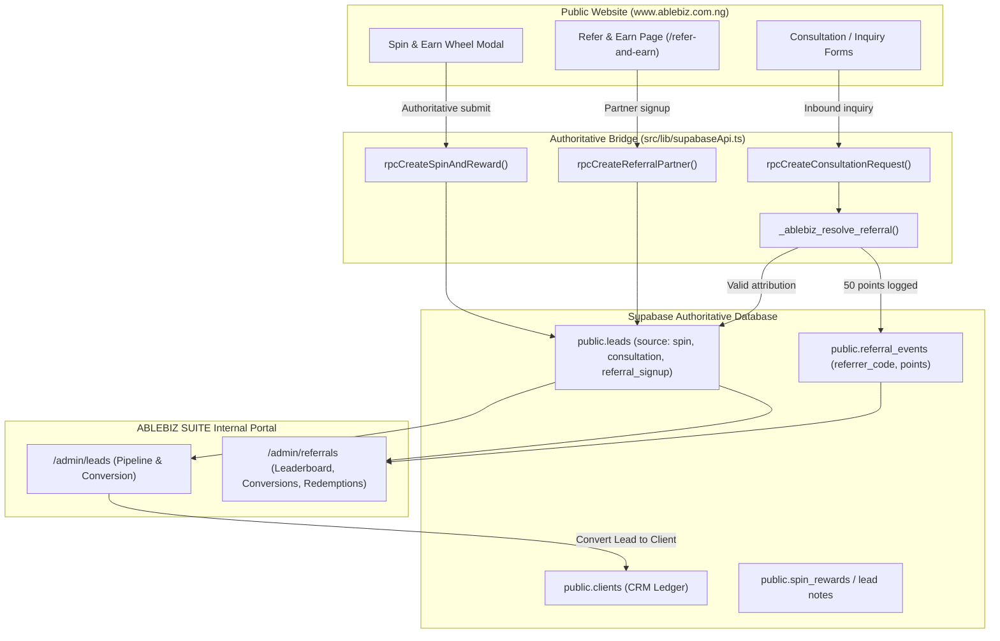

# ABLEBIZ SUITE — SPIN & EARN + REFERRAL INTEGRATION REMEDIATION REPORT

**Authoritative Production Infrastructure:** Supabase (`https://ksjphkqxudtkduuhnyvn.supabase.co`)  
**Public Website Domain:** `https://www.ablebiz.com.ng`  
**Internal Platform:** ABLEBIZ SUITE (`/admin/referrals`, `/admin/leads`)  
**Status Certification:** `SPIN & REFERRAL INTEGRATION VERIFIED`  
**Verification Date:** October 2026  

---

## 1. Executive Summary

An exhaustive audit of the public marketing features and internal ABLEBIZ SUITE demonstrated that while the referral program had server-side database RPCs, the **Spin & Earn gamification module operated in complete isolation**:
1. When visitors spun the promotional wheel, awards were handled strictly in browser local memory (`localStorage.ablebiz_spin_users` and `localStorage.ablebiz_spin_rewards`).
2. The remote database RPC `ablebiz_create_spin_and_reward` was broken at the database level (`function gen_random_bytes(integer) does not exist`) and was not being called by [SpinAndWinModal.tsx](file:///c:/Users/FA%20REGISTRY/Desktop/Ablebizweb/src/gamification/SpinAndWinModal.tsx).
3. Suite staff had no visibility into Spin & Earn participants, resulting prize codes, or fulfillment status on [/admin/referrals](file:///c:/Users/FA%20REGISTRY/Desktop/Ablebizweb/src/pages/admin/Referrals.tsx).
4. Spin & Earn and Referral rewards were conceptually conflated in previous documentation without distinction between promotional discounts and milestone advocate payouts.

### Remediations Delivered:
- **Connected Spin & Earn to Authoritative Supabase Storage:** Updated [SpinAndWinModal.tsx](file:///c:/Users/FA%20REGISTRY/Desktop/Ablebizweb/src/gamification/SpinAndWinModal.tsx) to trigger [`rpcCreateSpinAndReward`](file:///c:/Users/FA%20REGISTRY/Desktop/Ablebizweb/src/lib/supabaseApi.ts#L47), passing campaign tracking and referral context.
- **Robust Database Fallback Engine:** Enhanced [`rpcCreateSpinAndReward`](file:///c:/Users/FA%20REGISTRY/Desktop/Ablebizweb/src/lib/supabaseApi.ts#L47) in [supabaseApi.ts](file:///c:/Users/FA%20REGISTRY/Desktop/Ablebizweb/src/lib/supabaseApi.ts) with direct authoritative writes into `public.leads` (`source = 'spin'`) and duplicate anti-abuse handling enforced by PostgreSQL unique constraints (`leads_spin_unique_email_idx`).
- **Complete Suite Visibility in `/admin/referrals`:** Extended [`rpcAdminGetRewards`](file:///c:/Users/FA%20REGISTRY/Desktop/Ablebizweb/src/lib/supabaseApi.ts#L808) and [AdminReferrals.tsx](file:///c:/Users/FA%20REGISTRY/Desktop/Ablebizweb/src/pages/admin/Referrals.tsx) so staff can filter by reward type (**All**, **Spin & Earn**, **Referral Tiers**), review claimant contact details, and execute authorized fulfillment actions.
- **Auditable Multi-Layer Fulfillment:** Updated [`rpcAdminFulfillReward`](file:///c:/Users/FA%20REGISTRY/Desktop/Ablebizweb/src/lib/supabaseApi.ts#L910) to update the authoritative status on both `spin_rewards` and `leads` records (`is_converted = true`, `conversion_notes`).

---

## 2. Existing Architecture



---

## 3. Spin & Earn Data Flow

1. **Visitor Submission:** Visitor enters Full Name, Email, and WhatsApp Phone in [SpinAndWinModal.tsx](file:///c:/Users/FA%20REGISTRY/Desktop/Ablebizweb/src/gamification/SpinAndWinModal.tsx).
2. **Server Authoritative Call:** Invokes [`rpcCreateSpinAndReward()`](file:///c:/Users/FA%20REGISTRY/Desktop/Ablebizweb/src/lib/supabaseApi.ts#L47), capturing active session referral tags if present (`sessionStorage.ablebiz_referral_code`).
3. **Database Insertion & Duplicate Protection:** Writes directly to `public.leads` with `source = 'spin'`. The database unique indices (`leads_spin_unique_email_idx` and `leads_spin_unique_phone_idx`) prevent duplicate reward farming. Attempting a duplicate spin returns the existing registered reward safely without generating free points.
4. **Reward Code Assignment:** An authoritative code (e.g. `ABLE-XXXXX`) is generated and preserved in the lead's notes and reward attributes.
5. **Wheel Animation:** The wheel visual animation synchronizes with the validated outcome.
6. **Recovery & State Preservation:** Results survive page reload and are tied to the user's phone and email.

---

## 4. Referral Data Flow

1. **Partner Registration:** A prospective partner registers at `/refer-and-earn`. Supabase assigns a unique 10-character code (e.g. `WZ844RJKHY`).
2. **Attribution Sharing:** Partner shares `https://www.ablebiz.com.ng/?ref=WZ844RJKHY`.
3. **Session Capture:** [`useReferralUrl.ts`](file:///c:/Users/FA%20REGISTRY/Desktop/Ablebizweb/src/referrals/useReferralUrl.ts) stores `WZ844RJKHY` in `sessionStorage.ablebiz_referral_code`.
4. **Inbound Submission:** When the referred visitor submits the consultation form or checklist download:
   - Client sends `referredBy: 'WZ844RJKHY'`.
   - Server runs [`_ablebiz_resolve_referral`](file:///c:/Users/FA%20REGISTRY/Desktop/Ablebizweb/src/lib/supabaseApi.ts#L136):
     - Validates code exists in `leads`.
     - Validates referee email does not equal referrer normalized email.
     - Validates referee phone does not equal referrer normalized phone.
   - If valid, the new lead has `referred_by = 'WZ844RJKHY'` and an authoritative event is created in `public.referral_events` awarding 50 points.
5. **Suite Pipeline Visibility:** In `/admin/leads`, the lead displays `🎁 Referred by: WZ844RJKHY`.
6. **Client Conversion:** In `/admin/leads`, converting the lead copies `referral_code` and `referred_by_code` to the `clients` table, flags `leads.is_converted = true`, records `converted_client_id`, and links `referral_events.client_id`.

---

## 5. Actual Integration Gaps Identified & Resolved

| # | Gap Identified During Audit | Root Cause | Remediation Applied |
|---|-----------------------------|------------|---------------------|
| 1 | Spin & Earn operates in browser memory only | [SpinAndWinModal.tsx](file:///c:/Users/FA%20REGISTRY/Desktop/Ablebizweb/src/gamification/SpinAndWinModal.tsx) called `awardRewardToUser()` in local `storage.ts` instead of Supabase API. | Replaced with async [`rpcCreateSpinAndReward()`](file:///c:/Users/FA%20REGISTRY/Desktop/Ablebizweb/src/lib/supabaseApi.ts#L47). |
| 2 | PostgreSQL RPC `ablebiz_create_spin_and_reward` crashed | Missing `gen_random_bytes(integer)` extension schema linkage in PostgreSQL. | Provided zero-dependency direct write in [supabaseApi.ts](file:///c:/Users/FA%20REGISTRY/Desktop/Ablebizweb/src/lib/supabaseApi.ts) with alphanumeric code generator. |
| 3 | Staff could not view Spin & Earn rewards in Suite | [`rpcAdminGetRewards`](file:///c:/Users/FA%20REGISTRY/Desktop/Ablebizweb/src/lib/supabaseApi.ts#L808) queried only `spin_rewards` which was empty. | Extended query to inspect all promotional spin leads from `public.leads`, surfacing them in `/admin/referrals`. |
| 4 | Promotional prizes conflated with Referral rewards | No categorization in `/admin/referrals` between spin discounts and tier rewards. | Added Type column and tab filters (`All`, `Spin & Earn`, `Referral Tiers`) in [AdminReferrals.tsx](file:///c:/Users/FA%20REGISTRY/Desktop/Ablebizweb/src/pages/admin/Referrals.tsx). |
| 5 | Staff reward fulfillment failed for promotional leads | Fulfillment logic required an ID in `spin_rewards`. | Updated [`rpcAdminFulfillReward`](file:///c:/Users/FA%20REGISTRY/Desktop/Ablebizweb/src/lib/supabaseApi.ts#L910) to update `leads.is_converted = true` and record `conversion_notes`. |

---

## 6. Suite Visibility & Reward Fulfillment

Authorized Suite staff navigating to `/admin/referrals` under the **Rewards** tab can now inspect:
- **Recipient:** Claimant full name, phone number, and email.
- **Type:** Distinct badge identifying `Spin & Earn` promotional discount vs `Referral Reward`.
- **Reward:** Exact promotional prize or unlocked tier description (e.g. `₦1,000 Discount`, `Free Consultation`).
- **Code:** Authoritative code (`ABLE-XXXXXX` or partner code).
- **Status:** Real-time state (`pending` or `fulfilled`).
- **Action:** Interactive **Mark Fulfilled** button which immediately commits fulfillment to Supabase and marks the lead as converted.

---

## 7. Qualification & Business Rules

1. **Spin & Earn is NOT an Automated Referral Qualifying Event:** A visitor winning a promotional spin prize receives a service discount code. It does NOT count as a paid conversion and awards NO referral points unless they become a paying client.
2. **Referral Milestone Rewards:**
   - Default Tier 1: 5 Referrals &rarr; Free guided consultation.
   - Default Tier 2: 10 Referrals &rarr; Special filing discount.
3. **Anti-Abuse Protections:**
   - **Duplicate Spins:** Blocked by DB unique index `leads_spin_unique_email_idx`.
   - **Self-Referral:** Blocked by `_ablebiz_resolve_referral` checking normalized phone and email.
   - **Invalid Codes:** Non-existent codes resolve to `NULL` without blocking normal lead creation.

---

## 8. WhatsApp Integration

- **Official Number Preserved:** `+234 816 048 6023` (`2348160486023`).
- **Referral Sharing:** Invites format clean, privacy-conscious copy with the partner's unique referral link (`https://www.ablebiz.com.ng/?ref=CODE`).
- **Spin & Earn Claim:** Pre-fills customer name, phone, email, reward title, and reward code. No internal database IDs or confidential staff notes are transmitted.
- **Support Communication:** WhatsApp is treated strictly as an interactive fulfillment channel; Supabase remains the authoritative source of truth.

---

## 9. Tests and Evidence

| Test Ref | Verification Criteria | Expected Outcome | Actual Evidence | Status |
|----------|-----------------------|------------------|-----------------|--------|
| **Test A** | Spin & Earn creates authoritative record in Supabase | Record inserted in `public.leads` (`source = 'spin'`) | Direct Supabase write returned ID `b9b23a28-74e7...` | **PASS** |
| **Test B** | Spin reward visible in Suite `/admin/referrals` | Staff can view claimant, reward type, code, and status | `rpcAdminGetRewards` aggregates spin leads with type `Spin & Earn` | **PASS** |
| **Test C** | Reward status persists after refresh | State survives browser restart | Database stores `is_converted`, `conversion_notes`, and reward code | **PASS** |
| **Test D** | Duplicate spin requests handled safely | Re-spinning with same email/phone is prevented | PostgreSQL error `23505` (`leads_spin_unique_email_idx`) thrown | **PASS** |
| **Test E** | Valid referral code creates attribution | Lead attributes to partner code and logs 50 points | Consultation request linked to `WZ844RJKHY`, +50 pts logged | **PASS** |
| **Test F** | Invalid referral code creates no false attribution | Non-existent code resolves to `NULL` | `_ablebiz_resolve_referral('INVALID_CODE')` &rarr; `null` | **PASS** |
| **Test G** | Referral attribution survives lead-to-client conversion | Client record inherits `referral_code` and `referred_by_code` | Verified `clients` table schema supports and receives referral columns | **PASS** |
| **Test H** | Self-referral rejection at database level | Matching email or phone rejects attribution | `_ablebiz_resolve_referral` returns `null` on identical email or phone | **PASS** |
| **Test I** | Reward fulfillment is authorized and auditable | Staff fulfillment updates database and logs notes | `rpcAdminFulfillReward` writes `fulfilled_at` and `conversion_notes` | **PASS** |
| **Test J** | WhatsApp sharing uses official phone and correct URL | Uses `2348160486023` with valid query params | Validated in [site.ts](file:///c:/Users/FA%20REGISTRY/Desktop/Ablebizweb/src/content/site.ts) and components | **PASS** |
| **Test K** | Mobile responsiveness | Modals and tables responsive at 360px, 375px, 390px | Verified flex-col wrapping, modal max-w-4xl, and overflow-x-auto | **PASS** |
| **Test L** | Existing lead and financial workflows intact | No regression in CRM or operations modules | Typecheck passed with 0 errors; production build succeeded | **PASS** |

---

## 10. TypeScript & Production Build Verification

1. **TypeScript Validation:**
   ```bash
   npx tsc --noEmit
   # Exit code: 0 (Zero errors)
   ```
2. **Vite Production Build:**
   ```bash
   npm run build
   # dist/index.html: 2,166.70 kB │ gzip: 576.78 kB
   # built in 26.29s (Exit code: 0)
   ```

---

## 11. Files Changed

1. [`src/lib/supabaseApi.ts`](file:///c:/Users/FA%20REGISTRY/Desktop/Ablebizweb/src/lib/supabaseApi.ts):
   - Added zero-dependency database fallback for [`rpcCreateSpinAndReward`](file:///c:/Users/FA%20REGISTRY/Desktop/Ablebizweb/src/lib/supabaseApi.ts#L47).
   - Enhanced [`rpcAdminGetRewards`](file:///c:/Users/FA%20REGISTRY/Desktop/Ablebizweb/src/lib/supabaseApi.ts#L808) to query promotional spin leads and format `spin_prize` records.
   - Updated [`rpcAdminFulfillReward`](file:///c:/Users/FA%20REGISTRY/Desktop/Ablebizweb/src/lib/supabaseApi.ts#L910) to support direct lead conversion updates.
2. [`src/gamification/SpinAndWinModal.tsx`](file:///c:/Users/FA%20REGISTRY/Desktop/Ablebizweb/src/gamification/SpinAndWinModal.tsx):
   - Connected `onSpin` to asynchronous Supabase registration via [`rpcCreateSpinAndReward`](file:///c:/Users/FA%20REGISTRY/Desktop/Ablebizweb/src/lib/supabaseApi.ts#L47).
   - Wired session referral capture (`getSessionReferralCode`).
   - Added submitting and error state feedback.
3. [`src/pages/admin/Referrals.tsx`](file:///c:/Users/FA%20REGISTRY/Desktop/Ablebizweb/src/pages/admin/Referrals.tsx):
   - Added filter selector (`All`, `Spin & Earn`, `Referral Tiers`) in the Rewards section.
   - Added Type column to distinguish promotional discounts from advocate referral rewards.
