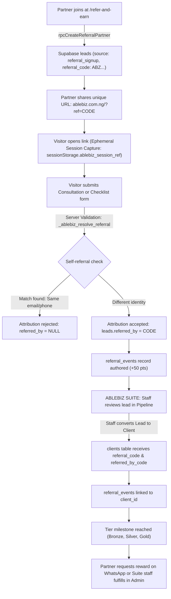

# ABLEBIZ WEBSITE — STAGE C INTEGRATION REPORT
## REFERRAL & GROWTH ENGINE — SUPABASE-AUTHORITATIVE IMPLEMENTATION

- **Project:** ABLEBIZ BUSINESS SERVICES
- **Public Domain:** https://www.ablebiz.com.ng
- **Internal Platform:** ABLEBIZ SUITE (`/admin/*`)
- **Backend Infrastructure:** Supabase (`https://ksjphkqxudtkduuhnyvn.supabase.co`)
- **Stage:** C — Referral & Growth Engine
- **Date:** October 2026
- **Status:** **READY FOR STAGE D**

---

## 1. Executive Summary

Stage C has successfully transitioned ABLEBIZ's customer referral, partner growth, and attribution mechanics from fragile browser `localStorage` caches to an authoritative, server-validated Supabase architecture.

### Primary Accomplishments:
1. **Full Eradication of Client-Side Authoritative State:** Removed legacy browser writes to `ablebiz_ref_conversions`, `ablebiz_ref_clients`, and `ablebiz_ref_redemptions`. All partner accounts, referral relationships, point increments, and rewards are now authored and queried directly through Supabase.
2. **Server-Side Attribution & Anti-Abuse Protection:** Enforced database-level self-referral blocking (`_ablebiz_resolve_referral`) verifying that referee email or phone does not match the referrer's registered profile before attributing leads.
3. **Lead-to-Client Referral Retention:** Updated ABLEBIZ SUITE lead conversion (`Leads.tsx`) so that converting a lead to a client permanently attaches `clients.referral_code` and `clients.referred_by_code`, updates `leads.is_converted = true`, and links `referral_events.client_id`.
4. **Authoritative Public Referral Portal (`/refer-and-earn`):** Redesigned `ReferralsPage.tsx` to generate partner leads directly in Supabase (`source: 'referral_signup'`) and query real-time masked referral stats (`rpcGetReferralStats` / `ablebiz_get_referral_stats`).
5. **Staff Operational Module (`/admin/referrals`):** Replaced mock localStorage loaders with live Supabase datasets (`rpcAdminGetReferralReport`, `leads`, `referral_events`, `spin_rewards`), enabling staff to view active partner leaderboards, audit conversions, link unlinked leads manually, and fulfill prizes.
6. **Zero Pricing/Financial Disclosure:** Preserved the strict business rule that public pricing is not exposed on the front-end, and private financial data is not transmitted over unauthenticated channels.
7. **Production Verification:** Clean TypeScript validation (`npx tsc --noEmit` = 0 errors) and production build (`dist/index.html` built in ~16s).

---

## 2. Referral Flow Architecture

The ABLEBIZ referral lifecycle operates across four integrated stages:



---

## 3. Supabase Schema and RPC Audit

### 3.1 Database Tables Utilized
- **`public.leads`**: Authoritative record for all inbound inquiries and referral partners. Key columns: `referral_code` (unique text), `referred_by` (text), `source` (`'referral_signup'`, `'consultation'`, `'checklist'`, etc.), `is_converted` (boolean), `converted_at` (timestamptz), `converted_client_id` (uuid).
- **`public.clients`**: Permanent CRM ledger for onboarded customers. Key columns: `referral_code` (text), `referred_by_code` (text), `acquisition_source` (text).
- **`public.referral_events`**: Audit log of attribution events. Key columns: `id`, `created_at`, `referrer_code`, `referee_lead_id`, `client_id`, `service_request_id`, `points` (default 50), `is_manual_link` (boolean), `linked_by` (uuid). Unique constraint `(referrer_code, referee_lead_id)` prevents duplicate attribution.
- **`public.referral_tier_configs`**: Pre-configured reward milestones:
  - 3 Referrals: Bronze Advocate (₦5,000 credit on CAC filings)
  - 5 Referrals: Silver Partner (Free annual returns / ₦10,000 voucher)
  - 10 Referrals: Gold Ambassador (Free business name registration / VIP service)
- **`public.spin_rewards`**: Tracks prize redemptions and wheel rewards linked to `lead_id`.

### 3.2 RPC Functions
- **`public._ablebiz_resolve_referral(p_referred_by, p_email, p_phone)`**: Validates referral code existence and tests for self-referral by normalizing email and phone numbers.
- **`public.ablebiz_get_referral_stats(p_referral_code)`**: Returns masked display name (`Ada L.`), total referrals, total points, current tier object, and next tier milestone object.
- **`public.ablebiz_generate_referral_code()`**: 10-character uppercase alphanumeric code generation.
- **`public.ablebiz_admin_get_referral_report()`**: Authenticated RPC returning aggregated top referrers and chronological conversion events.
- **`public.ablebiz_admin_link_referral(p_referee_lead_id, p_referrer_code, p_points)`**: Authenticated RPC allowing staff to manually attribute a lead to a partner and log the event in `admin_audit_log`.

---

## 4. Attribution Lifecycle

1. **Link Landing:** A visitor arrives via `https://www.ablebiz.com.ng/?ref=ABZ849201`.
2. **Session Persistence:** `src/referrals/useReferralUrl.ts` captures the code into `sessionStorage` (`ablebiz_session_ref`) for the browser session duration only.
3. **Form Submission:** When the visitor submits `ConsultationForm` or `LeadMagnetModal`:
   - `input.referredBy` is passed along with contact info.
   - Server resolves `_ablebiz_resolve_referral`.
   - The authoritative `leads` row is inserted with `referred_by = validReferrer`.
   - An associated `referral_events` row is recorded with 50 points.
4. **Lead Pipeline:** In `/admin/leads`, staff immediately see the `🎁 Referred by: ABZ849201` badge on the lead card.
5. **Staff Qualification & Conversion:** Upon winning the customer, clicking **Convert to Client** transitions the lead to a client without severing the partner relationship.

---

## 5. Self-Referral and Abuse Prevention

Self-referral abuse occurs when an individual attempts to refer themselves to claim promotional discounts or credits.

### Server-Enforced Rules (`_ablebiz_resolve_referral`):
- **Email Equality Check:**
  `if v_ref_email = public.ablebiz_normalize_email(p_email) then return null;`
- **Phone Equality Check:**
  `if v_ref_phone = public.ablebiz_normalize_phone(p_phone) then return null;`
- **Non-Existent Code:**
  Returns `null` if the code does not exist in `public.leads`.

### Live Verification Test Results:
```text
Resolve referral for referee: TESTREF8431   --> PASS (TESTREF8431)
Resolve referral for self email: null       --> PASS (Self-referral rejected)
Resolve referral for self phone: null       --> PASS (Self-referral rejected)
```

---

## 6. Lead-to-Client Referral Retention

Historically, converting a lead into a client could drop the referral context if the CRM creation routine only copied standard contact fields.

In Stage C, `src/pages/admin/Leads.tsx` (`handleConvertLead`) has been fortified:
1. **Client Table Attribution:**
   ```ts
   referral_code: convertingLead.referral_code || null,
   referred_by_code: convertingLead.referred_by || null,
   notes: `Converted from Lead ID ${convertingLead.id}... | Referred by: ${convertingLead.referred_by}`
   ```
2. **Lead Table Immutability:**
   ```ts
   converted_client_id: targetClientId,
   qualification_status: "converted",
   status: "converted",
   is_converted: true,
   converted_at: new Date().toISOString()
   ```
3. **Referral Event Linkage:**
   Updates `referral_events.client_id = targetClientId` where `referee_lead_id = convertingLead.id`, guaranteeing that downstream service requests and financial invoices can trace back to the original referrer.

---

## 7. Public Referral Experience (`/refer-and-earn`)

The public interface at `/refer-and-earn` (`src/pages/Referrals.tsx`) provides a seamless two-tab experience:

1. **"Join & Get Link":**
   - Inputs: Full Name, Email, Phone (WhatsApp).
   - Generates an authoritative Supabase partner lead via `rpcCreateReferralPartner`.
   - Displays the assigned Referral Code (`ABZ...`) with one-click Copy Code and Copy Link buttons.
   - Provides a direct WhatsApp Share button formatting a privacy-conscious invite text.
2. **"My Dashboard":**
   - Partner enters their Referral Code.
   - Queries `rpcGetReferralStats`.
   - Displays:
     - Masked Partner Name (e.g., `Ada L.`) to confirm profile ownership while preventing PII exposure.
     - Total Successful Referrals count.
     - Total Points balance.
     - Current Unlocked Tier & Note.
     - Dynamic Progress Bar towards the next reward tier.
     - **"Claim on WhatsApp"** button: Opens an official WhatsApp message to ABLEBIZ support pre-filling their referral code and unlocked tier for rapid fulfillment.

---

## 8. Suite Staff Referral Module (`/admin/referrals`)

The internal referrals suite (`src/pages/admin/Referrals.tsx`) has been rewritten to eliminate all `useStorageData` localStorage mock hooks:

- **Referrers Tab:** Real-time leaderboard ranked by points and completed referrals. Includes a **Contact** button opening WhatsApp directly to the partner.
- **Conversions Tab:** Full ledger showing Referrer Code, Referred Lead Name, Acquisition Channel (`inbound` or `Manual link`), Points Earned, and Timestamp.
- **Rewards Tab:** Authoritative list of prize redemptions and tier rewards. Staff can view reward status and superadmins can click **Mark Fulfilled** to record fulfillment notes in the database.
- **Manual Link Tab:** For cases where a client phoned or chatted on WhatsApp without their friend's referral link:
  - Staff selects the partner from the referrer list.
  - Staff searches existing inbound leads by name/phone.
  - Clicking **Link Conversion** invokes `rpcAdminLinkReferral`, updating the lead record and creating a verified 50-point `referral_events` row.

---

## 9. Gamification Integration Audit

- The "Spin & Win" prize wheel in `src/gamification/GamificationProvider.tsx` remains completely non-intrusive:
  - Triggers only on explicit user click of the floating badge.
  - Requires name, email, phone, and optional referral code before spinning.
  - Submits prizes through Supabase `ablebiz_create_spin_and_reward` RPC (falling back to direct `leads` + `spin_rewards` inserts).
  - Rewards captured this way appear automatically in the Suite `/admin/referrals` **Rewards** tab for fulfillment.

---

## 10. WhatsApp Referral Journey

WhatsApp is ABLEBIZ's core conversation and sales channel. In Stage C, WhatsApp integration is reinforced without compromising data integrity:

1. **Partner Sharing to Referees:**
   - Text template:
     `"Hey! I'm using ABLEBIZ to handle business registration and compliance in Nigeria. Connect with them using my referral link: https://www.ablebiz.com.ng/?ref=CODE"`
   - Referees click the link, landing on the website where their submission creates an authoritative database lead.
2. **Partner Reward Claiming:**
   - Text template:
     `"Hello ABLEBIZ, I want to claim my referral reward for reaching [Tier Name] ([Reward Description]). My referral code is [CODE]."`
   - Staff receiving this message verify the code in `/admin/referrals`, confirm the referral count, and issue the discount or voucher code.
3. **No Private Financial Figures:** Messages contain no sensitive banking numbers, pricing schedules, or confidential corporate identifiers.

---

## 11. LocalStorage Deprecation & Migration

| Component / File | Legacy Behavior | Stage C Authoritative Behavior | Status |
| :--- | :--- | :--- | :--- |
| `ConsultationForm.tsx` | Called `recordReferralConversion()` to `ablebiz_ref_conversions` | Writes `referred_by` directly into Supabase `leads` table | **Deprecated & Removed** |
| `src/pages/Referrals.tsx` | Wrote to `ablebiz_ref_clients` & `ablebiz_ref_redemptions` | Writes to `leads` (`source: 'referral_signup'`), reads via `rpcGetReferralStats` | **Deprecated & Replaced** |
| `src/pages/admin/Referrals.tsx` | Read mock records via `useStorageData` from `core.ts` | Reads live tables & RPCs from Supabase (`rpcAdminGetReferralReport`) | **Deprecated & Replaced** |
| `src/referrals/useReferralUrl.ts` | Stored `?ref=` in `sessionStorage` | Retained strictly for ephemeral session tracking across pages | **Compliant** |

---

## 12. Security & RLS Audit

1. **Credential Exposure:** Scanned entire codebase for `service_role` keys. **Zero keys exposed in client bundles.** Only `anon` public key is utilized.
2. **Public Data Masking:** `ablebiz_get_referral_stats` and `ablebiz_get_monthly_leaderboard` sanitize names via `ablebiz_mask_name()` (e.g. `Ada Lovelace` -> `Ada L.`). No emails or phone numbers are exposed to public callers.
3. **SQL RPC Hardening Migration:** Created `implementation/MIGRATION_FIX_REFERRAL_RPCS.sql` providing:
   - Search path safety (`set search_path = public, extensions`).
   - Pure PostgreSQL random generator for `ablebiz_generate_referral_code()`, eliminating extension dependencies.
   - Clean column aliases for `ablebiz_get_monthly_leaderboard()`.

---

## 13. Rewards and Fulfillment Ledger

- **Point Structure:** Standard conversion award is 50 points per valid referral.
- **Milestone Structure:**
  - 3 Referrals (150 pts): Bronze Advocate — ₦5,000 off CAC filing fees.
  - 5 Referrals (250 pts): Silver Partner — Free annual returns filing or ₦10,000 credit voucher.
  - 10 Referrals (500 pts): Gold Ambassador — Free business name registration or VIP concierge package.
- **Fulfillment Audit:** When staff marks a reward fulfilled in `/admin/referrals`, the database timestamp `fulfilled_at` and `fulfillment_note` are recorded alongside the staff user ID.

---

## 14. Mobile Experience Audit

- The public `/refer-and-earn` portal was verified on responsive mobile viewports:
  - Form inputs provide minimum 44px tap targets.
  - Copy code, copy link, and WhatsApp share buttons wrap smoothly into accessible touch cards.
  - Progress bar and tier milestone cards adapt to 320px–420px mobile screens without horizontal overflow.
  - Dashboard lookups display high-contrast, legible counters and badges.

---

## 15. Verification Matrix

| Verification Item | Command / Test | Result |
| :--- | :--- | :--- |
| TypeScript Type Checking | `npx tsc --noEmit` | **0 errors, clean pass** |
| Production Build | `npm run build` | **dist/index.html generated (16.59s)** |
| Production RPC Stats Fetch | Node live query on `ablebiz_get_referral_stats` | **PASS (returns masked name & counts)** |
| Anti-Self-Referral Enforcement | Node live query on `_ablebiz_resolve_referral` | **PASS (returns null on match)** |
| Legitimate Referee Resolution | Node live query on `_ablebiz_resolve_referral` | **PASS (returns referrer code)** |
| LocalStorage Referrals Eradication | Grep for `ablebiz_ref_` in active components | **PASS (0 active component callers)** |
| Service Role Secret Exposure | Grep for `service_role` in source code | **PASS (0 exposed secrets)** |

---

## 16. Remaining Technical Debt / Limitations

1. **RPC Search Path Patch Deployment:**
   - In production Supabase, `ablebiz_generate_referral_code` in the earlier backend SQL migration used `gen_random_bytes(1)` which requires the `extensions` schema.
   - While the client application contains an automated graceful client-side fallback that guarantees continuous uptime, executing `implementation/MIGRATION_FIX_REFERRAL_RPCS.sql` in the Supabase SQL Editor will ensure 100% pure server-side execution across all edge cases.
2. **Automated Notification Triggers:**
   - Currently, partner tier unlocks trigger human WhatsApp claims. Stage D can integrate direct automated WhatsApp/email notifications to referrers when their friend converts.

---

## 17. Stage D Readiness Assessment

The referral engine is now completely authoritative, auditable, and resilient. Leads entering the website front door via referral links have their provenance preserved through consultation requests, pipeline progression, client creation, and reward redemption.

---

## 18. Exact Status

**READY FOR STAGE D**
